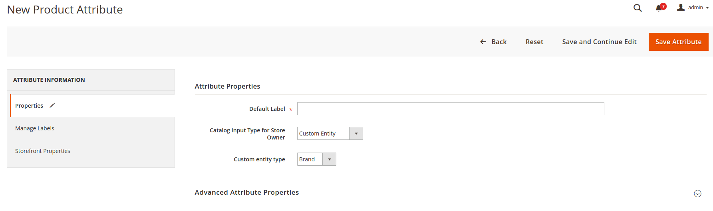
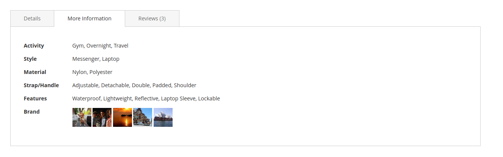
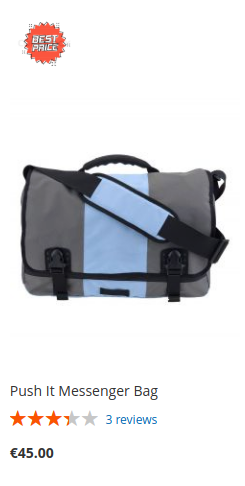
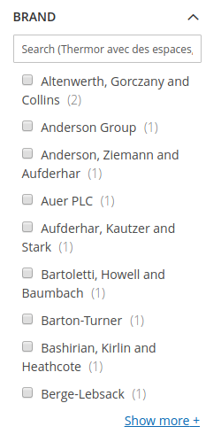
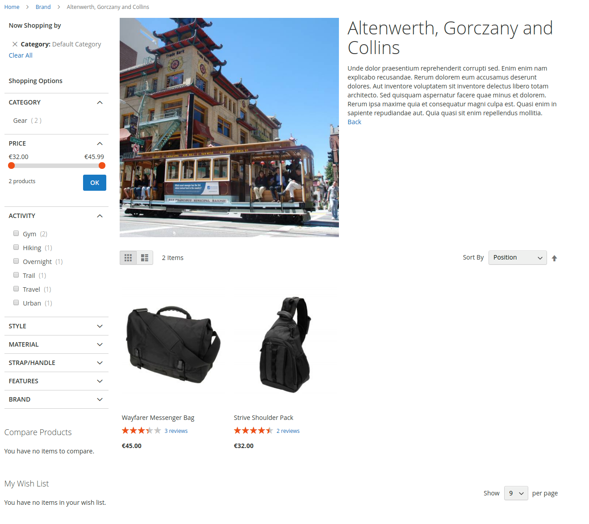

# Custom Entity Product Link Management

Custom Entity Product Link Management 
=====================================

## What is Custom Entity Product Link Magento 2 Module?

This module allow possibility to create a product attribute with Frontend Input `Custom Entity`, which allows you to link a product to custom entities and :

* show custom entities in product detail (or/and product listing)
* show products on custom entity page 

## Who is developing this module ? 

This module is built by Smile. 

Smile is the **European leader of Open Source** and also a four-times **Europe Partner of the the Year** (2010-2014), two-times **Spirit of Excellence** (2015-2016), **Global Elite Partner** (2017-now), and **Regional Commercial Partner** (2018) awarded by Magento.

Our multidisciplinary team brings together experts in technology, innovation, and new applications.

Together we explore, invent, and test technologies of the future, to better serve our clients.

## Main Features

* **An new frontend input in product attribute**

* **Show custom entity in product page and product listing**

* **A filter by custom entity**

* **Product listing in custom entity page**

## Documentation

Documentation is available [here](https://github.com/Smile-SA/magento2-module-custom-entity-product-link/wiki).

The User Guide is also available on PDF format [here](https://github.com/Smile-SA/magento2-module-custom-entity-product-link/wiki/static/UserGuide.pdf)

## Standards & Code Quality

Built on top of Magento2, our module respects all its prerequisites and code quality rules.

You can also find our PHPCS Standards and PHPMD rulesets in the module directory.

The module is also continuously tested on :

Tools                           | Results
------------------------------- |------------
Travis                          | 
